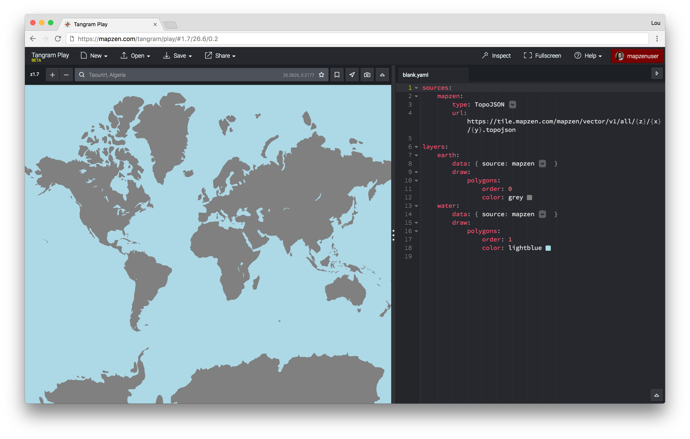

Style Editor for Tangram Styles

## Query string API

* ```lines=[number]/[number-number]```: you highlight a line or a range of lines. Example ```lines=10-12```.

* ```style=[url.yaml]```: load a specific ```.yaml``` file using a valid url

## Keys

* ```Ctrl``` + ```[number]```: Fold indentation level ```[number]```
* ```Alt``` + ```F```: fold/unfold line
* ```Alt``` + ```P```: screenshot of the map

Sublime-like hotkeys
* ```Ctrl``` + ```F```: Search
* ```Ctrl``` + ```D```: Select next occurrence
* ```Alt``` + ```ArrowKeys```: move word by word
* ```Shift``` + ```ArrowKeys```: Select character by character
* ```Shift``` + ```Alt``` + ```ArrowKeys```: Select word by word

## Local installation / build process

Clone this repository, then, in this repository's root directory, run the following:

```sh
npm install  # Installs Node modules dependencies
gulp js css  # Builds Javascript and CSS files to /build
```

Typing `gulp` by itself runs the Javascript and CSS build scripts, and additionally starts a watcher that will rebuild each time the source files are changed. If a [LiveReload](http://livereload.com/) server is active, it will also publish stylesheet updates to LiveReload. You may safely kill the gulp process at any time by hitting Ctrl-C.

Tangram-Play is a static site, and can be viewed by any static fileserver, such as Python's [SimpleHTTPServer](https://docs.python.org/2/library/simplehttpserver.html) or Node's [http-server module](https://www.npmjs.com/package/http-server).

Compiled files in the `build/` directory are committed and published to GitHub so that [GitHub Pages](https://pages.github.com/) have access to it. Generally, I try not to include the compiled files with every commit until something is ready to go live. This makes it easier to back out of strange merge conflicts and keeps the history from getting too complicated.
